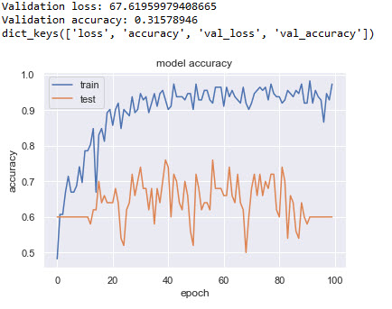

# Automatic-classification-of-skin-lesions-melanoma-detection-

This work uses the database of the ISIC Challenge 2017: Skin Lesion Analysis Towards Melanoma Detection.

It focuses on the third part of the challenge: Disease classification. Considering that we already have the segmented images and the superpixels of the original images.

Given the space occupied by the Database images I couldn't upload them into github, here is a link to directly download them from Google Drive : https://drive.google.com/drive/folders/1rdTHZGWpA-qXyyuFjcsyqHilXCNJCwvA?usp=sharing

Both Python and Matlab are used for different classification approaches using geometric descriptors, texture descriptors and color irregularity features. A CNN is then used on pre-treated images to achieve higher accuracy.

Attached files contain two main scripts, one in Python and the other in MATLAB, the rest of the MATLAB files are functions used in the main file.

Please read the report (also contained in the file Skin_lesion_classifier.pdf) for details about the approaches used and the results obtained, it is written in LateX and in English language, the scripts are also commented in English.

# TB3: Image and Pattern recognition 2019-

# Project -Automatic classification of skin lesions (melanoma detection)-

## Abdelhakim Benechehab

## January 2019

The objective of this project is to propose a methodology for the automatic
classification of skin lesions, based on image analysis and machine learning.

## 1 PART 1: Description of the Database and pre-processing

Here is a sample of the images we are willing to process (Original image of
skin lesion and the segmented image): Figure 1


We dispose also of the segmentation of the original images using super-pixels,
these last ones will be used later with geometrical descriptors on Python.
Our database is composed of 200 samples, which are part of a 2000 original
database from the world wide challenge: "ISIC 2017: Skin Lesion Analysis To-
wards Melanoma Detection". The images’ names are not ordered and a complex
reading system was coded into MATLAB to load all of these images


and assign to each one of them their corresponding labels, the script attached
this report is well commented on explaining every part of this process.
The loading step has been done twice, in MATLAB and Python since I used
both of them to classify the images. Here is a sample from the Database loaded
and labeled in Python: Figure 2


  
We will now take profit of several machine learning models to achieve
good accuracy in our classification problematic, the steps of the different
methods used will not be detailed as much as in the first project, still the
scripts attached are very well commented.

## 2 Classification using texture descriptors (LBP) :

The Local Binary Patterns (LBP) descriptor is simple yet very efficient
texture operator that labels the pixels of an image by thresholding the neighborhood of each pixel and considers the result as a binary number, the details of the descriptor was seen in the course. For a given image of a skin lesion, I computed the LBP histogram for its three components (Red, Green, and Blue), the result is the following Figure 3


We can see that the three histograms are almost superimposed, so for the classification, we will only use one of them, this allows us to reduce significantly the complexity of our model since we will have only 255 descriptors instead of 765.
The LBP descriptor is then computed on the first (red) component of all
images in our database, we now have a representation of the individuals (images of skin, lesion) in a 255 dimensions space.
The next step is splitting the population into training and test sets just
like the first project, 4 classifiers are then trained on this Data with automatic Hyper-parameters optimization: Decision trees, Knn, Discriminant analysis and a naive Bayesian classifier (I tried to use binary classifiers that were not used before).
Using the function metrics coded, I then compute the accuracy and FScore for each one of these classifiers and plot them into a bar-plot to decide


Figure3 – LBP histogram of three color components of the skin lesion image of the best one among them, this gives the following Figure 4


  
The discriminant analysis Classifier is the best one among the 4 used with the following scores :
Accuracy= 76.0000%
F Score= 0. 7000

The corresponding Confusion Matrix and ROC curve: Figure 5
The accuracy we got with this model is not very satisfying, hence we are
going to try more efficient classifiers in the next section.


## 3 Classification using geometrical descriptors (Region-Props) + Color irregularity (number of super-pixels) :

Analogically with the first project, the geometrical descriptors will be composted on the segmented images. Just like MATLAB, Python has a library skimage.measure that contains a function regionprops_table that computes all possible geometric descriptors for binary images: area, bbox_area, convex_area, eccentricity, equivalent_diameter, extent, major_axis_length, minor_axis_length, perimeter.

```
1 props = sm.regionprops_table(train_images[i], ...
properties=['area', ...
'bbox_area','convex_area','eccentricity','equivalent_diameter',
2 'extent','major_axis_length','minor_axis_length','perimeter'])
```
To reduce the complexity of the classifier, I used the Python library sklearn.feature_selection, and exactly the function SelectKBestto select the 5 best features from the 9 we had, this reduces the number of the space’s dimensions and help improve the rapidity of the classifier.

```
1 %I will select only the best 5 best features among the 9 computed
2 imgdata_new = SelectKBest(chi2, k=5).fit_transform(imgdata, ...
train_labels)
3 %I won't go into details but the chi2 metric is adequate for the ...
classification problem
```
A sixth feature is then added to the obtained features’ matrix: It’s the number of superpixels computed by analyzing the three components (Red, Green, and Blue) of the given superpixels image.


At this step our Data is ready to go into classifiers, the same splitting is
performed again (75% Training Data and 25% test Data). I am going to use 5 classifiers: Logistic regression, Decision tree, Gradient descent, Gradient boosting and Knn.
The data we have is not sufficient for an efficient classifier, 200 hundred
images are not enough, hence, for a credible accuracy value I used cross-validation on 10 samples for every model, the mean value of the accuracy’ values obtained is considered to evaluate the classifiers then.
The accuracy results are as following: Figure 6


  
```
Accuracy= 80.6000%
```
The best model is the Gradient Boosting model, with about 80% (around
75% before adding the number of superpixels as a feature) accuracy on 10 sampling data using cross-validation. The idea that comes to mind next is combining the geometric descriptors, the texture descriptors (LBP has been done on MATLAB) and the color irregularity feature which is the number of superpixels, unfortunately, I didn’t have the time to test it since it requires a considerable pre-treatment before running it into Machine learning models.

## 4 Classification using a CNN (Convolutional neural network) :

In papers about the original challenge, I read that the best accuracy values (>95%) were obtained using deep learning, so as a bonus method, I decided to use a CNN to classify the images.
The biggest problem is that we have really few images, so after splitting the Data we have (112 training images, 50 test images, 38 validation images) which is not enough to evaluate CNN’s performance and decide on the accurate values for its hyper-parameters.
Another problem is the high dimensions of our images (767*1022*3), so
passing through a Convolutional layer is like an infinite operation for a normal laptop. To encounter this issue I used only one component of the image resized to smaller dimensions (84*112) as input images even if this would remove a considerable part of the information contained in the images.
The details of the layers used and the values of the parameters of this model are in the attached script which is well commented.
The accuracy plot for training and test Data gave the following: Figure 7


  
Our CNN can achieve very high training accuracy (96%) but still fails with the test Data, since we have not enough Data it is difficult to know the reason behind this issue and correct it, it could be simply by chance due to the low number of test images, same remark for the validation accuracy which is computed on an even smaller set of images.
A sophisticated visualization with the percentage of belonging to each class in the next Figure: 8


  
Even if it was not very successful in our case due to many reasons, a CNN well-settled can be very efficient in an image classification problem.


